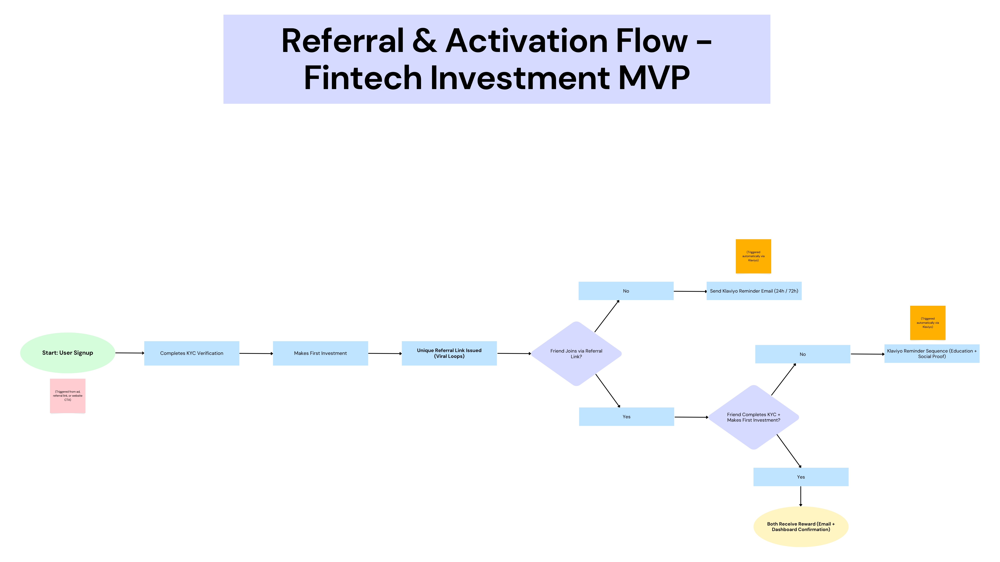
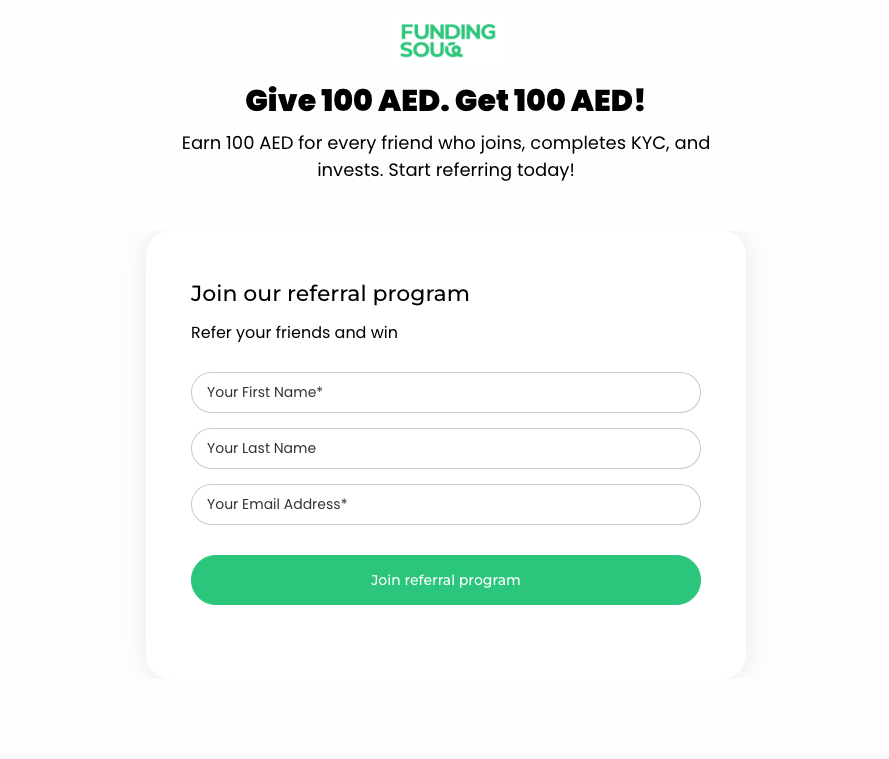
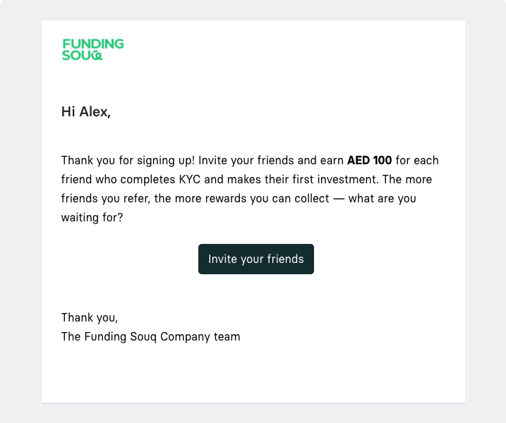
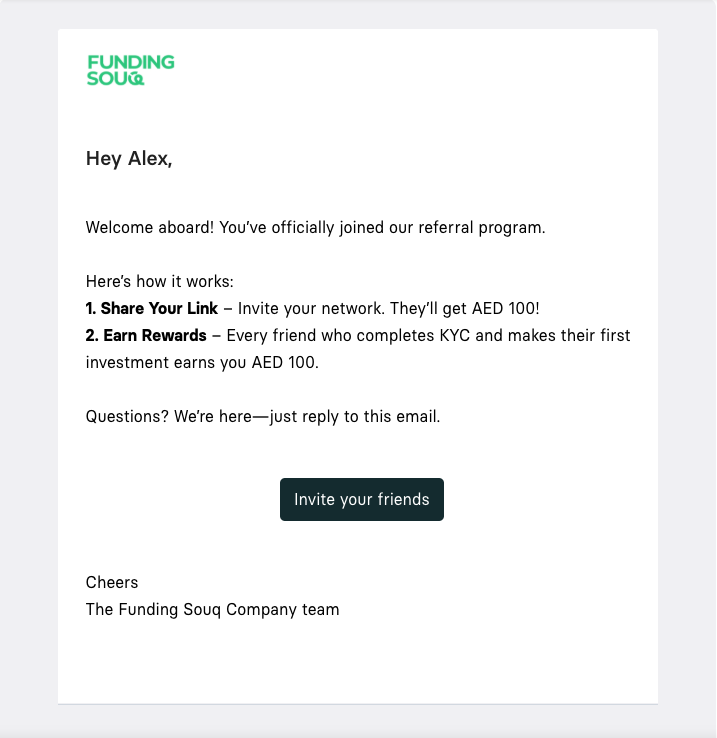
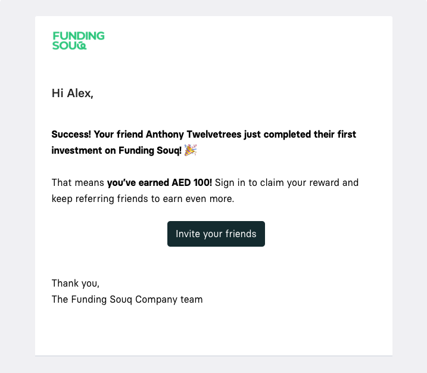
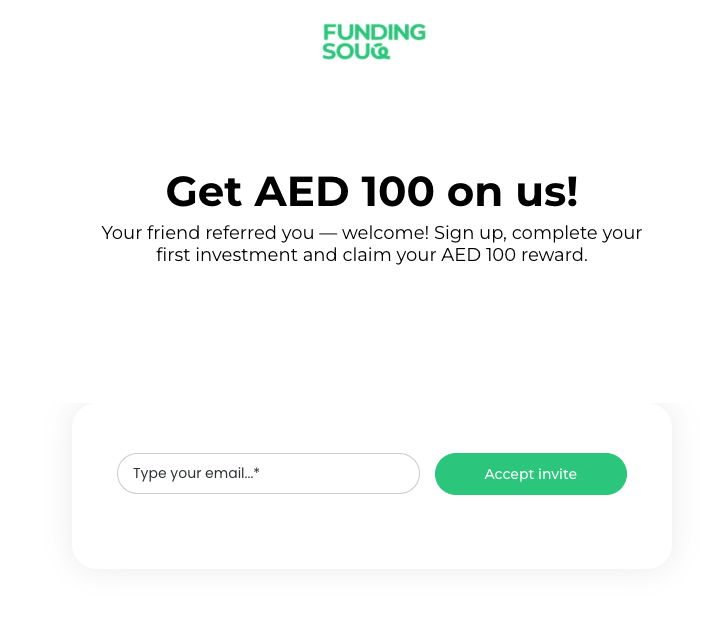
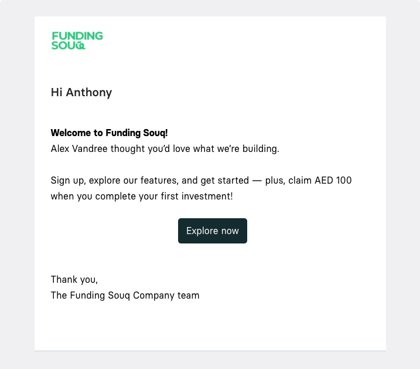

## 💳 Fintech Lead Acquisition & Referral Program
*Accelerating verified investor growth through referral-driven automation and targeted onboarding.*

**Client:** Funding Souq — Fintech Investment Platform (Conceptual Project)  
**Objective:** Increase verified investor sign-ups and first-time investments while lowering customer acquisition costs through an automated referral program.

---

### 1. The Challenge

Funding platforms like Funding Souq often face:

- High drop-off between sign-up and KYC verification
- No structured referral program to leverage investor networks
- Generic follow-ups that don’t nudge verification or sharing
- No unified view of referral performance or investor acquisition

Impact: lost opportunities for **organic growth** and **first-time investments**.

---

## 2. Strategy — Referral + Activation System

**Target Segments:**
- **New High-Intent Visitors:** Viewed “For Investors” page multiple times; potential for first-time investment.
- **Trial / Partial-Verifiers:** Signed up but didn’t complete KYC; prime for referral nudges. 
- **Verified Users (Potential Advocates):** Completed KYC and made their first investment; can refer friends.

**Channels & Tools:**
Viral Loops (referral engine) · Klaviyo (emails & onboarding) · GA4 & Looker Studio (tracking & reporting) · Meta & LinkedIn Ads (retargeting) · Typeform (demo KYC/investment)

**Methods:**
- Two-sided referral rewards: Both referrer and referee earn incentives, triggered by first qualifying investment.
- Automated referral flow: Viral Loops handles link sharing, tracking and notifications.
- Onboarding nudges: Progressive prompts guide users to complete KYC and make their first investment.
- MVP-first demo: Proof-of-concept using Viral Loops + manual tracking (Google Sheets/Zapier) before full integration.
- Performance measurement: Track referral → KYC → first investment to quantify CAC reduction and new capital inflow.

---

### 3. Execution

- Deployed a Viral Loops–powered referral system, issuing unique share links post sign-up.
- Designed two-sided rewards, triggered by referee completing KYC and first investment, reinforcing trust and incentivizing action.
- Built Klaviyo email automation flows aligned with user behavior:  
  - Welcome & Verification Reminder (24h / 72h)
  - Referral Invitation & Social Proof Messaging
  - Reward Confirmation & Dormant User Reactivation
- Configured GA4 events (view_invest_page, signup_start, kyc_submitted, kyc_completed) and audiences (high-intent, partial verifiers) for precise retargeting via Meta & LinkedIn Ads.
- Developed a Looker Studio dashboard combining Viral Loops conversions, Klaviyo engagement, GA4 events, and paid channel ROI, highlighting referral performance, top traffic sources and conversion trends.
- Maintained consistent copy and creative direction across emails, referral pages, and paid ads to maximize credibility and conversion flow.

---

### Referral & Activation Flow (Fintech Investment MVP)
Visualizes the journey from signup → verification → investment → referral → reward.
Highlights automation triggers (Klaviyo) and incentive checkpoints (KYC + first investment).

  

---

### Referral Program Experience (Email + Landing Assets)
*(Mockups showing end-to-end communication flow — created in Canva.)*

#### 🔹 Referrer Experience  

   
  <em>“Give 100 AED. Get 100 AED” landing page. </em>

  

  

  

#### 🔹 Referred User Experience  

  

  

---

### 4. Results & Impact
*These are modeled projections based on industry benchmarks and a 90-day MVP + paid test scenario. Real results should be validated and iterated once the campaign runs.*

- **+25–30%** projected increase in verified investor accounts.
- **~15–20%** projected uplift in referral-driven sign-ups from existing investors.
- **2–3×** projected ROI on targeted retargeting spend once referral conversions begin.
- **~20–25%** projected average CTR for referral and activation email sequences.

---

### 5. Key Insight

In fintech, trust and clear incentives drive referrals. Verified investors who feel confident and acknowledged are more likely to invite peers, who in turn complete verification and make their first investment. A structured, automated referral program with targeted follow-ups helps scale high-quality investors efficiently, and a visual blueprint or demo tool makes potential impact clear to clients before full implementation.

---

## Contact
Shayma Solli — Business & Growth Marketing Consultant 
📧 shayma.solli@gmail.com

---

**License:** CC-BY (Use this conceptual blueprint freely; please credit the author if reused).
